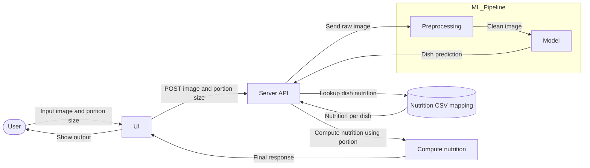

# DINE: Dish Image Nutrition Estimator
Computer vision for your nutrition

- Project name: `dine`
- Description: Estimate nutritional information from image of a meal
- Data Source: https://huggingface.co/datasets/Codatta/MM-Food-100K
- Type of analysis: Computer Vision

## ToC
- [DINE: Dish Image Nutrition Estimator](#dine-dish-image-nutrition-estimator)
  - [ToC](#toc)
- [Project Structure](#project-structure)
- [Startup the project](#startup-the-project)
- [Project Development](#project-development)
- [Environmental variables](#environmental-variables)
  - [Loading local variables](#loading-local-variables)
- [GCP](#gcp)
  - [Create a clean dataset](#create-a-clean-dataset)
    - [1. `make clean_dataset`](#1-make-clean_dataset)
    - [2. `make dataset`](#2-make-dataset)
- [Inference Pipeline](#inference-pipeline)
  - [MVP1](#mvp1)
- [Documentations](#documentations)

---
# Project Structure
```
.
├── api/            # FastAPI endpoints
└── dine/           # Core Python package: ML models, preprocessing, training, inference logic
    └── params.py   # Global environmental variables. NO SECRETS ALLOWED
├── docs/           # Documentations
├── frontend/       # Frontend app
├── notebooks/      # Jupyter notebooks for exploration, and experiments
├── scripts/        # Utility / CLI scripts (create dataset, etc.)
├── tests/          # Unit and integration tests
├── Makefile        # Project command shortcuts
├── MANIFEST.in     # Packaging instructions (include extra files in distributions)
└── setup.py        # Package configuration for installation (defines dine as installable package)
```
---

# Startup the project

The initial setup.

Create virtualenv:
```bash
# Create new venv
pyenv virtualenv 3.10.6 dine_venv

# Set as local venv
pyenv local dine_venv

# Activate (if not auto)
source dine_venv/bin/activate
```

Unittest test:
```bash
make clean install test
```

# Project Development

Go to `https://github.com/t-fahira267/dine/tree/master` to see the project, manage issues,
setup you ssh public key, ...

Clone the project and install it:

```bash
# Clone repo
git clone git@github.com:t-fahira267/dine.git

# Install dependencies
cd dine
pip install --upgrade pip
pip install -r requirements.txt

# Install project package with editable flag
pip install -e .
```

# Environmental variables
Defined in two files:
1. `dine/params.py` : Global parameters used in the project. NO SECRETS ALLOWED
2. local `.env` : Local parameters and secrets stored here. DO NOT PUSH TO REPO

## Loading local variables
Make sure that direnv has been installed and `.envrc` file is available in project root directory

Create `.env` file, and add some default parameters
```bash
echo "BASE_DATA_DIR=data/mmfood100k" >> .env
```

Load variables
```bash
# In project root directory, run
direnv allow .
```

If you made some changes, reload variables
```bash
direnv reload .
```

# GCP

**GCS Bucket Location**

```
gs://mmfood/
```

Region: asia-northeast1 (Tokyo)

## Create a clean dataset
Clean dataset is created as a one-time artifact or versioned occasionally.
<br>Currently, we are using [Codatta/MM-Food-100K](https://huggingface.co/datasets/Codatta/MM-Food-100K) as main dataset.

There are two ways to create it:
### 1. `make clean_dataset`
  <br> Dataset can be created **directly in local directory** or **directly in GCS**
  <br> creates image dataset with the following structure:
  ```
  .
  └── mmfood/v1/
      └── images/
          ├── sushi/
          └── ...
      ├── labels.csv
      └── metadata.json
  ```
   - **images/** : Contains downloaded images grouped by canonical dish label.
   - **labels.csv** : Columns incl. `image_path | label | portion_size`
   - **metadata.json** : Contains meta information such as versioning, total samples, and class distribution

   How to run:
   1. (Optional) Modify the relevant env. variables in params.py
      ```
      SAVE_MODE = "local"  # or "gcs"
      ```
   2. Run the following commands:
      ```bash
        # (Le Wagon students only) Unset default creds
        unset GOOGLE_APPLICATION_CREDENTIALS

        # Login to Google Cloud Console with the Google account that has permission to dine project
        gcloud auth application-default login

        # Check you can reach the bucket
        gsutil ls gs://mmfood

        # Create dataset
        make clean_dataset
      ```

### 2. `make dataset`
  <br> Dataset is created by **downloading the images to local directory then uploading to GCS**
  <br> creates image dataset with the following structure:
  ```
  .
  └── mmfood/mmfood100k/v1/
      └── images/
          ├── sushi/
          └── ...
      ├── labels.csv
      └── candidates.csv
  ```
   - **images/** : Contains downloaded images grouped by canonical dish label.
   - **labels.csv** : Columns incl. `image_path | label`
   - **candidates.csv** : Cleaned up .csv data that will serve as the unique source of truth

   How to run:
   1. (Optional) Modify the relevant env. variables in params.py
      ```
      SAVE_MODE = "local"  # or "gcs"
      ```
   2. Run the following commands:
      ```bash
        # (Le Wagon students only) Unset default creds
        unset GOOGLE_APPLICATION_CREDENTIALS

        # Login to Google Cloud Console with the Google account that has permission to dine project
        gcloud auth application-default login

        # Check you can reach the bucket
        gsutil ls gs://mmfood

        # Create dataset
        make dataset
      ```


# Inference Pipeline

## MVP1


# Documentations
Check `docs/`
- About Output and Business metric
- Nutrition lookup table calculation
- Other references
